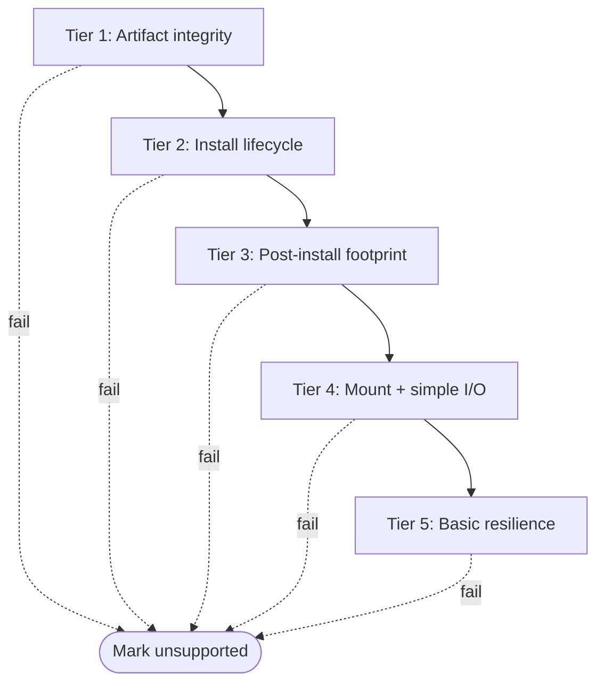
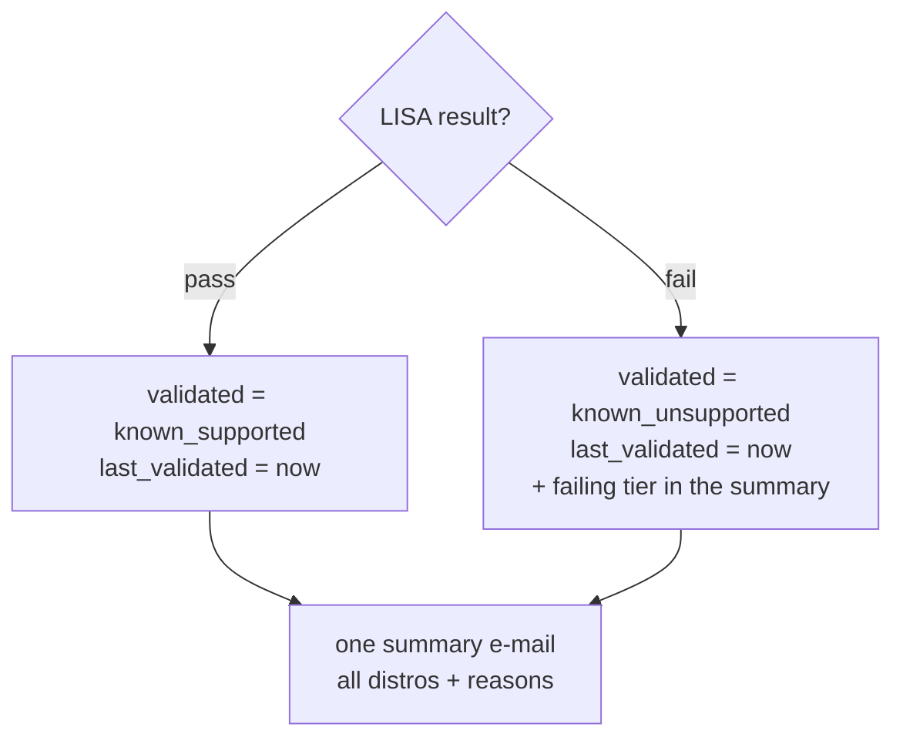

# Phase 3: AzNFS Package Validation (LISA)

Phase 3 is the **validation** stage of the marketplace-distro pipeline. After
Phase 1 discovers a new distro image and Phase 2 confirms the Azure Files package
(AzNFS) is published on PMC **prod**, Phase 3 uses **LISA** to provision a VM of
that distro, install the package, and assert it works — producing a pass/fail
"distro readiness" signal.

> The test code lives in **this repo** under [`../phase3/`](../phase3) (test
> suite + runbook + orchestrator). LISA is the engine, installed separately in a
> venv; the runbook's `extension: ["../testsuites"]` makes LISA load the suite
> directly from this repo — nothing is copied into a LISA checkout. See §4 for
> the layout and §6 for setup/run.

## Pipeline context

| Phase | Output | Responsibility |
|-------|--------|----------------|
| Phase 1 | `output/needs_validation.json` | Scan marketplace, diff against SQLite |
| Phase 2 | `lisa_jobs.json` (distro + prod package URL + version) | Confirm the package is published on PMC prod |
| **Phase 3** | **Pass/fail per distro** | **Provision VM, install, validate, record** |

A LISA pass marks the distro `known_supported`; a failure marks it
`known_unsupported`. Skips (e.g. wrong package family) are recorded separately
and do not count as failures. Phase 3 is **LISA testing only** — it does not
query PMC prod (Phase 2 already owns that check).

## What is under test

AzNFS is a **mount helper + watchdog** for Azure Files NFS:

| Component | Type | Footprint check |
|-----------|------|-----------------|
| `mount.aznfs` | mount-helper binary (runs only during a mount) | must be **available** on PATH — NOT "running" |
| `aznfswatchdog` | systemd **daemon** (keeps mounts alive on IP change) | must be **running/active** |

> `.rpm` covers RHEL/Oracle, SLES, Azure Linux; `.deb` covers Debian/Ubuntu.
> Distros outside these families are **skipped**, not failed.

## Test plan: 5 tiers

The validation runs as a fail-fast funnel — cheap static checks first, the
share-dependent checks last.



### Tier 1 — Artifact integrity (static, pre-install)
- Signature / digest valid (`rpm -K`)
- Metadata correct: name, version, architecture (`rpm -qpi` / `dpkg-deb -I`)
- Dependencies declared (`rpm -qpR`)

### Tier 2 — Install lifecycle
- Clean install (exit 0, dependencies resolve)
- Reinstall / idempotency
- Clean uninstall (package no longer registered)

> Upgrade-from-previous and the AzNFS **auto-update** feature are deferred to a
> follow-up (need a known prior version + reachable update channel).

### Tier 3 — Post-install footprint
- Package registered, version matches expected
- Files intact (`rpm -V`)
- `mount.aznfs` **available** (`which mount.aznfs`) — it is a helper, not a daemon
- `aznfswatchdog` daemon **running** (`systemctl is-active`)

### Tier 4 — Functional (mount + simple I/O)
- Mount an Azure Files NFS share via AzNFS (`mount -t aznfs`)
- Create + write a small file, read it back, verify contents, delete
- Run **without EIT** and **with EIT** (encryption-in-transit) when the EIT
  mount option is configured

> Deliberately minimal — confirms the share is **accessible**. No heavy/stress
> I/O and no xfstests suite (these belong to a separate functional effort).

### Tier 5 — Basic resilience
- Baseline: mount + simple I/O works
- Restart/kill `aznfswatchdog`
- Existing mount still serves I/O
- `aznfswatchdog` recovers to active

> Port-kill, multiple shares/accounts, real IP rotation, and VM-reboot timing
> are deferred (multi-account needs a LISA feature extension).

## Test cases and cost model

The 5 tiers are grouped into **3 LISA test cases**, one VM each (VMs are
provisioned and destroyed sequentially — never running in parallel), repeated
per distro via the runbook's `marketplace_image`.

| Test case | Tiers | Needs a share? |
|-----------|-------|----------------|
| `verify_aznfs_install_lifecycle` | 1, 2, 3 | No |
| `verify_aznfs_nfs_functional` | 4 (EIT off + on) | Yes |
| `verify_aznfs_resilience` | 5 | Yes |

## What each tier failure blames

| Tier fails | Likely culprit |
|------------|----------------|
| 1 | Bad package build/publish (Phase 2) |
| 2 | Install/dependency issue on this distro |
| 3 | Packaging placed files incorrectly |
| 4 | AzNFS cannot mount/serve on this distro |
| 5 | AzNFS watchdog/recovery broken on this distro |

## Inputs (runbook variables)

These are provided per run (Phase 2 supplies the first two); nothing is
hardcoded in the test code.

| Variable | Meaning |
|----------|---------|
| `aznfs_package_url` | PMC prod download URL for the exact package (supplied by Phase 2) |
| `aznfs_pmc_repo` | PMC repo (fallback install path if no URL) |
| `aznfs_expected_version` | version to assert, e.g. `0.3.2` |
| `aznfs_mount_type` / `aznfs_mount_opts` | AzNFS mount type + NFSv4.1 options |
| `aznfs_eit_mount_opts` | EIT mount option (empty = skip EIT variant) |

## Repository layout

All Phase 3 artifacts live in **this repo** (source of truth). §6 explains how
LISA loads the test code from here.

```
marketplace-distro-scanner/
├── docs/PHASE3.md                       # this document
└── phase3/
    ├── README.md                        # short placement/run guide
    ├── AUTOMATION.md                     # the end-to-end automated run
    ├── run_phase3.py                     # automation driver (LISA per distro -> verdict)
    ├── testsuites/
    │   ├── __init__.py
    │   └── aznfs_validation.py           # the LISA test suite (3 cases / 5 tiers)
    ├── runbooks/
    │   ├── aznfs_validation.yml          # LISA runbook (platform + aznfs_* inputs)
    │   └── aznfs_multidistro.yml         # batch combinator for many distros at once
    ├── examples/
    │   └── jobs.example.json             # sample Phase 2 hand-off
    └── orchestrator/                     # record the verdict (NOT a LISA test)
        ├── __init__.py
        ├── config.py
        ├── record_result.py              # DB update + one summary e-mail
        └── schema_phase3.sql             # adds the last_validated column
```

## Setup and run (local dev, WSL)

The test **code** lives in this repo; the LISA **engine** is installed once in a
Python venv. The runbook's `extension: ["../testsuites"]` makes LISA load the
suite directly from this repo — no copying.

### One-time setup

1. Use a WSL distro on the **Linux filesystem** (not `/mnt/c` — DrvFs cannot set
   the venv symlinks or the `600` perms LISA needs on the SSH key). Confirm which
   distro with `wsl --list --verbose`; run everything in the same one.
2. Install the LISA engine (editable) from an `azfiles-lisa` checkout placed in
   the Linux home, into a venv in the Linux home:
   ```bash
   sudo apt update
   sudo apt install -y git gcc libgirepository1.0-dev libcairo2-dev \
     qemu-utils libvirt-dev python3-pip python3-venv unixodbc-dev
   python3 -m venv ~/lisa-venv
   source ~/lisa-venv/bin/activate
   pip install --upgrade pip
   # from the azfiles-lisa checkout (the engine). '.[azure]' only (NOT libvirt).
   pip install --editable '.[azure]' --config-settings editable_mode=compat
   ```
3. Verify: `lisa` (runs the local hello-world sample) should pass.

### Each run

```bash
source ~/lisa-venv/bin/activate
cd ~                       # runtime/log + the SSH key must land on Linux fs
az login                   # refresh creds (tokens expire)

lisa run -r /mnt/c/Users/<you>/marketplace-distro-scanner/phase3/runbooks/aznfs_validation.yml \
  -v subscription_id:<sub> \
  -v marketplace_image:"RedHat:RHEL:9_5:latest" \
  -v aznfs_package_url:"https://packages.microsoft.com/rhel/9.0/prod/Packages/a/aznfs-0.3.458-1.x86_64.rpm" \
  -v aznfs_expected_version:"0.3.458" \
  -v keep_environment:no \
  -v case_name:verify_aznfs_install_lifecycle
```

Notes:
- **Case selection** is `-v case_name:<name>` (the `name` criteria is a regex
  *fullmatch*; the runbook default `verify_aznfs.*` selects all three). `-c` is
  NOT a case selector — `lisa` only accepts `run` / `list` / `check`.
- Start with `verify_aznfs_install_lifecycle` (no Azure share = cheapest).
- `lisa list -r <runbook> -v subscription_id:placeholder -t case` lists cases
  without deploying anything.
- Results: console + HTML report under `~/runtime/log/...`.

## Running in parallel (faster)

Each case uses its own fresh VM, and most of a run is idle VM-boot time, so the
big speed-up is **running environments concurrently** rather than one-by-one.

Two settings control this, and they must agree:

| Setting | Serial (default-safe) | Parallel |
|---------|----------------------|----------|
| `concurrency` | `1` | `N` (envs at once) |
| `resource_group_name` | a pinned name | **empty** (one RG per env) |

Why they're linked: LISA uses a **single fixed ARM deployment name and one SSH
key file per resource group**. Two environments sharing one *pinned* RG collide
(`DeploymentActive`, or an SSH-key race). With `resource_group_name` **empty**
(the runbook default), LISA creates a fresh RG per environment — own VNet, own
deployment, own key — and deletes that whole RG on cleanup, so they're
independent and parallel-safe.

```bash
# One distro, all 3 cases at once (~17 min instead of ~50):
lisa run -r .../phase3/runbooks/aznfs_validation.yml \
  -v subscription_id:<sub> -v concurrency:3 -v keep_environment:no \
  -v marketplace_image:"RedHat:RHEL:9_5:latest" \
  -v aznfs_package_url:"https://packages.microsoft.com/rhel/9.0/prod/Packages/a/aznfs-0.3.458-1.x86_64.rpm"
```

Bound `concurrency` by your subscription's regional vCPU quota (each VM here is
2 vCPUs). To force the old serial/pinned mode: `-v resource_group_name:<rg>
-v concurrency:1`.

## Running multiple distros at once

Use the dedicated multi-distro runbook
[`aznfs_multidistro.yml`](../phase3/runbooks/aznfs_multidistro.yml). It
`include`s the base runbook and adds a **`batch` combinator** that pairs each
distro with its matching package URL + version (a single fixed URL can't work
across families — RHEL needs an `.rpm`, Ubuntu/Debian a `.deb`):

```yaml
combinator:
  type: batch
  items:
    - marketplace_image: "RedHat:RHEL:9_5:latest"
      aznfs_package_url: "https://packages.microsoft.com/rhel/9.0/prod/Packages/a/aznfs-0.3.458-1.x86_64.rpm"
      aznfs_expected_version: "0.3.458"
    - marketplace_image: "canonical 0001-com-ubuntu-server-jammy 22_04-lts latest"
      aznfs_package_url: "https://packages.microsoft.com/ubuntu/22.04/prod/pool/main/a/aznfs/aznfs_0.3.458_amd64.deb"
      aznfs_expected_version: "0.3.458"
```

```bash
# items x cases = environments (2 distros x 3 cases = 6 VMs). Set concurrency
# to that to run them all simultaneously:
lisa run -r .../phase3/runbooks/aznfs_multidistro.yml \
  -v subscription_id:<sub> -v concurrency:6 -v keep_environment:no
```

> **Package versioning.** Phase 2 tracks the AzNFS `0.3.x` series on PMC prod, so
> the URLs here use that line (RHEL `.rpm`, Ubuntu/Debian `.deb`). Always confirm
> the exact URL resolves (`curl -sI <url>`) before adding a distro. Debian's PMC
> pool path differs from Ubuntu's and currently 404s at the obvious location —
> confirm its real path before adding Debian items.


## Known-good test inputs (RHEL)

| Input | Value |
|-------|-------|
| `marketplace_image` | `RedHat:RHEL:9_5:latest` |
| `aznfs_package_url` | `https://packages.microsoft.com/rhel/9.0/prod/Packages/a/aznfs-0.3.458-1.x86_64.rpm` |
| `aznfs_expected_version` | `0.3.458` |
| `use_public_ips` | `true` (required for local WSL runs) |

The package **format/arch must match the VM**: a RHEL x64 VM needs an
`x86_64.rpm`; do not feed it a `.deb` or `arm64` artifact.

## Recording the verdict (orchestration)

This step runs **after** LISA validation and is **orchestration code, not a LISA
test case** (see [`../phase3/orchestrator/`](../phase3/orchestrator)). Phase 3 is
LISA testing only \u2014 there is **no PMC prod query** here (Phase 2 already owns the
"is it published on prod?" check). The orchestrator simply records each distro's
verdict in the shared SQLite `images` table and, at the **end of the run**, sends
**one** summary e-mail.

- **LISA pass** \u2192 `validated = known_supported`, `last_validated = now`.
- **LISA fail** \u2192 `validated = known_unsupported`, `last_validated = now`. This
  is terminal \u2014 there is no automatic retry. A LISA failure can be a real
  package problem **or** a transient/flaky run (slow boot, SSH timeout); if a
  flake wrongly buries a good distro, a human resets that row's `validated` back
  to `unknown` so the pipeline re-validates it.



The DB row is matched on the **same 5-key identity Phase 1/Phase 2 use**
(`publisher, image, sku, region, architecture`) so the update actually lands.

### The failing tier (actionable failures)

Each assertion in the suite is tagged with a `[Tier N: step]` prefix
(`[Tier 1: artifact]`, `[Tier 2: install]`, `[Tier 3: footprint]`,
`[Tier 4: mount]`, `[Tier 4: io]`, `[Tier 5: watchdog]`). The driver extracts
that tag from the junit failure and puts it in the summary, so a failure reads
e.g. *"SLES 15.5 \u2014 [Tier 4: mount] failed to mount \u2026 via aznfs"* rather than a
bare "failed".

### The summary e-mail

Exactly **one** e-mail per run, listing every distro and \u2014 for the failures \u2014
the failing tier:

```
[AzNFS Phase 3] validation summary: 1 supported, 1 unsupported (of 2)

Supported (known_supported) (1):
  - RHEL 9.5

Unsupported (known_unsupported) (1):
  - SLES 15.5: [Tier 4: mount] failed to mount ... via aznfs
```

Run the orchestrator standalone (records verdicts from a results file):
```bash
python -m phase3.orchestrator.record_result <lisa_jobs.json>
```

## Troubleshooting / bring-up findings

Real issues hit during bring-up and their fixes — all infrastructure/config, not
test-logic bugs.

| Symptom | Cause | Fix |
|---------|-------|-----|
| `lisa: command not found` | Wrong WSL distro (venv/engine is in the other one) | Run in the distro that has `~/lisa-venv`; check the prompt user |
| venv / editable-install fails on `/mnt/c` (`Operation not permitted`, `egg-info`) | DrvFs can't do Linux symlinks/perms | Put venv **and** the engine clone on the Linux fs (`~/...`) |
| `selected count: 0` | Runbook had no `extension:` block / name didn't match | `extension: ["../testsuites"]`; `name` is a regex fullmatch (`verify_aznfs.*`) |
| `cannot connect to TCP port [10.0.0.x:22]` | VM only had a private IP | `use_public_ips: true` (local runs) |
| `ResourceGroupBeingDeleted` | `az group delete --no-wait` then immediate run | `az group wait --deleted` first, or just don't delete (LISA reuses the RG) |
| Tier 1 fails on `rpm -K` exit 1 | Wrong artifact (`.deb`/`arm64` on RHEL x64) | Use the matching `x86_64.rpm` |
| `yum install` hangs the whole timeout on `Running scriptlet: aznfs` | The aznfs `%post` scriptlet shows an **interactive whiptail dialog** ("Enable auto update for AZNFS mount helper") on `/dev/tty`; under LISA's pty it blocks forever waiting for input | Run the install with **`AZNFS_NONINTERACTIVE_INSTALL=1`** (and `DEBIAN_FRONTEND=noninteractive`). `node.os.install_packages` can't pass env vars, so invoke the package manager directly with `update_envs` |
| RHEL repo metadata `HTTP 400` (rare) | Out-of-date `rhui-azure-*` client | `handle_rhui_issue()` + `yum clean all` (done in `_prepare_package_manager`) |
| Tier 4/5 fail at `nfs.create_share()` with **`KeyBasedAuthenticationNotPermitted`** | LISA's `Nfs.create_share()` creates the storage account with shared-key access **disabled** (engine default) but then uses the **account key** to talk to the file-share data-plane endpoint | Engine fix: pass `allow_shared_key_access=True` in `Nfs.create_share()`'s `check_or_create_storage_account` call (`features.py`). No subscription policy blocks shared key here |
| Mount fails right after share creation: `mount.nfs: access denied by server` (via `127.0.0.1`) | A brand-new Azure Files NFS export is briefly not ready; the mount (correctly routed through AzNFS's `127.0.0.1` local proxy) is rejected for a short window. Proven transient — the same mount succeeds on retry | **Retry the mount with a delay** (`_provision_and_mount` retries `_MOUNT_RETRIES` times, `_MOUNT_RETRY_DELAY`s apart). The mount syntax/options are correct |
| Case fails at SSH `ssh connection cannot be established` after a slow boot | RHEL first boot in centralindia is highly variable; `try_connect`'s own `ssh_timeout` (300s, separate from the 600s port wait) can still be exceeded | Re-run (usually transient); for robustness raise `wait_tcp_port_ready`/`ssh_timeout`, or use a pre-baked image / faster region (the self-hosted runner) |
| `AuthorizationFailed` on `subscriptions/read` | Azure CLI token expired | `az login` again |
| Two envs collide with **`DeploymentActive`** / SSH key auth fails when running in parallel | `concurrency > 1` with a **pinned** `resource_group_name`: LISA shares one ARM deployment name and one `id_rsa` per RG | Keep `concurrency: 1` while the RG is pinned; true parallelism needs one RG per environment (the self-hosted VNet runner) |

**Key install insight (root cause, proven from the run log):** the hang is **not**
a lock, a slow boot, or RHUI. The dependencies resolve and download fine; the
install reaches `Running scriptlet: aznfs-0.3.458-1` and then freezes because the
package's post-install script renders an interactive `whiptail` **"Enable auto
update? <Yes>/<No>"** dialog on `/dev/tty`. LISA allocates a pseudo-terminal, so
the dialog appears and waits for a keypress that never comes — the command is
killed at the 1800 s timeout. The aznfs script honours
`AZNFS_NONINTERACTIVE_INSTALL=1` to skip that prompt, so we set it (via
`update_envs`, which LISA exports *inside* the elevated shell so the rpm scriptlet
inherits it). An earlier "install works fine" manual test was misleading — it ran
over `ssh host "<cmd>"` with **no** pty, so whiptail auto-defaulted instead of
blocking. The `rhui-azure-*` client was already current there and on the LISA VM,
so RHUI was never the cause; the `handle_rhui_issue()` + `yum clean all` step is
kept only as cheap defence for images that do ship a stale client.

## Open follow-ups

- Confirm exact names/paths: package (`aznfs`), service (`aznfswatchdog`),
  helper (`mount.aznfs`), install dir — via `rpm -qlp`.
- Confirm exact AzNFS mount syntax and the EIT mount option.
- Decide install order: prod URL first vs PMC repo first.
- Later tiers: upgrade/auto-update, port-kill + multi-account resilience.
