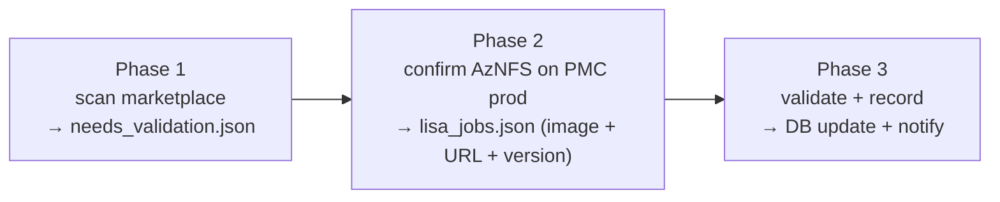
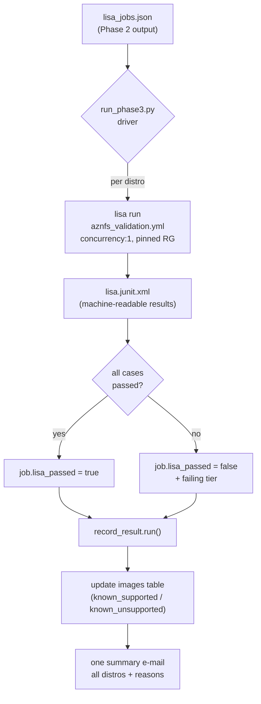

# Phase 3 — Automatic run (end-to-end)

How Phase 3 runs **with no human in the loop**, from a new distro image to a
recorded support decision and a team notification.

This complements [`../docs/PHASE3.md`](../docs/PHASE3.md) (the test plan and the
manual/local commands). Here we describe the **automated** scenario: what
triggers it, what runs, and what comes out.

---

## 1. Where Phase 3 sits in the pipeline



Phase 3's **input** is Phase 2's `lisa_jobs.json`; its **output** is an updated
`images` table (`known_supported` / `known_unsupported`, `last_validated`) plus a
single summary notification. Phase 3 is **LISA testing only** — it does not query
PMC prod (Phase 2 owns that check).

---

## 2. The automatic Phase 3 flow



Three moving parts, all already in this folder:

| Part | File | Role |
|------|------|------|
| **Driver** | [`run_phase3.py`](run_phase3.py) | Sequences the whole flow |
| **LISA suite + runbook** | [`testsuites/`](testsuites), [`runbooks/aznfs_validation.yml`](runbooks/aznfs_validation.yml) | Provision VM, install, validate (5 tiers) |
| **Orchestrator** | [`orchestrator/record_result.py`](orchestrator/record_result.py) | DB update + one summary e-mail |

### Step by step

1. **Read** Phase 2's `lisa_jobs.json` (one entry per distro: image URN,
   published package URL + version, arch).
2. **Validate** each distro: the driver runs `lisa run` on the base runbook with
   `-v` overrides. All 3 cases run **in parallel** (`concurrency:3`) inside one
   **pinned resource group** (`lisa-aznfs-phase3`), so distros run **serially**
   (one env at a time). The `junit` notifier writes `lisa.junit.xml`.
3. **Score**: the driver parses that XML — a distro **passes** when it has at
   least one executed case and **zero** failures; on a failure it extracts the
   failing `[Tier N: step]` tag.
4. **Record + report**: results go to `record_result.run()`, which writes each
   verdict to the DB (`known_supported` on pass, `known_unsupported` on fail) and
   sends **one** summary e-mail listing every distro and the failing tier for
   the failures.
5. **Exit code**: `0` only if every distro passed validation — so CI can gate on
   it.

---

## 3. Running it

```bash
# from the repo root, with the LISA venv active and `az login` done.
# RG is pinned (PHASE3_RESOURCE_GROUP=lisa-aznfs-phase3) -> the driver forces
# --concurrency 1 / --max-parallel-distros 1 (one shared RG can't run envs in
# parallel). Unset PHASE3_RESOURCE_GROUP for per-env RGs + real parallelism.
python -m phase3.run_phase3 path/to/jobs.json \
  --subscription-id 8ffe006d-4aa2-4eb6-bc3c-f33092ef804a
```

- Pinned RG = least privilege: the MI needs only Virtual Machine + Network +
  Storage Account Contributor on `lisa-aznfs-phase3` (no subscription-scope
  resourcegroups/write). Trade-off: distros run one at a time.
- To parallelize: unset `PHASE3_RESOURCE_GROUP`, then `--max-parallel-distros N`
  runs N distros at once. VMs in flight ≈ `max_parallel_distros × 2 vCPUs`;
  bound by regional vCPU quota.

An example input is in [`examples/jobs.example.json`](examples/jobs.example.json).

> The driver runs each distro as its own `lisa run` for **simple, reliable
> result attribution** (one junit file per distro).

---

## 4. What triggers it (scheduling)

Phase 3 is a batch job, triggered however Phases 1–2 are. Typical options:

- **Scheduled CI** (Azure DevOps pipeline / GitHub Actions cron): nightly or on
  a Phase 2 completion event, run the three phases in sequence; Phase 3's last
  step is `python -m phase3.run_phase3 jobs.json --subscription-id ...`.
- **Event/artifact chained**: Phase 2 publishes `jobs.json` as a pipeline
  artifact; a Phase 3 stage consumes it.

Minimal CI stage (illustrative):

```yaml
- stage: phase3_validate
  jobs:
    - job: validate
      steps:
        - script: |
            python -m pip install -e '.[azure]'   # LISA engine
            az login --identity                    # pipeline managed identity
            python -m phase3.run_phase3 "$(Pipeline.Workspace)/jobs.json" \
              --subscription-id "$(SUBSCRIPTION_ID)" \
              --concurrency 3 --max-parallel-distros 6
```

### Auth in automation

- **Azure** (deploy test VMs): the runner's **managed identity** — the runbook
  already uses `credential.type: default`, which picks up the pipeline identity;
  no keys in the runbook.
- **E-mail** (the summary): the shared Phase 1 ACS notifier
  (`scripts/notifier.py`), authenticated by the same managed identity.

---

## 5. What you get out

- **DB**: each distro's `images` row updated — `known_supported` /
  `known_unsupported` and `last_validated`. See
  [`orchestrator/schema_phase3.sql`](orchestrator/schema_phase3.sql).
- **Notification**: a single end-of-run summary e-mail listing every distro and
  the failing tier for any failures.
- **Artifacts**: each distro's LISA run dir (console log, HTML report,
  `lisa.junit.xml`) under `runtime/log/...`.
- **Exit code**: non-zero if any distro failed validation (for CI gating).

---

## 6. Scaling notes (from real runs)

- Most of a run is idle VM **boot** time, so distro-level and case-level
  parallelism is what cuts wall-clock — not faster code. A 6-environment run
  completed in ~18 min versus ~100 min serial.
- The real ceiling is the subscription's **regional vCPU quota** (and, for the
  share-mounting tiers, storage-account limits), not time.
- Slow first boots in some regions are the main flake source; the engine SSH
  timeouts were raised to tolerate them. A pre-baked image (Shared Image
  Gallery) or a faster region removes most of that wait.
